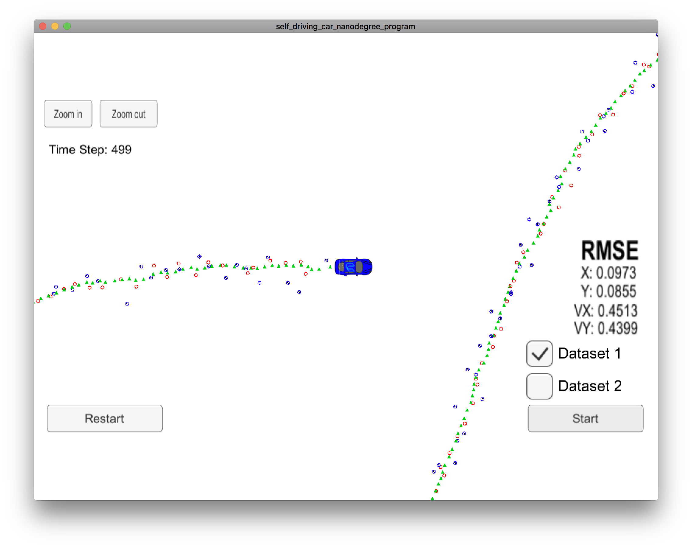

# Self-Driving Car Engineer Nanodegree Program - Extended Kalman Filter Project

## Dependencies

* uWebSocketIO (see `install-mac.sh` or `install-ubuntu.sh`)
* cmake >= 3.5
  * All OSes: [click here for installation instructions](https://cmake.org/install/)
* make >= 4.1 (Linux, Mac), 3.81 (Windows)
  * Linux: make is installed by default on most Linux distros
  * Mac: [install Xcode command line tools to get make](https://developer.apple.com/xcode/features/)
* gcc/g++ >= 5.4
  * Linux: gcc / g++ is installed by default on most Linux distros
  * Mac: same deal as make - [install Xcode command line tools](https://developer.apple.com/xcode/features/)

## How to build and run

1. mkdir build
2. cd build
3. cmake ..
4. make
5. ./ExtendedKF
